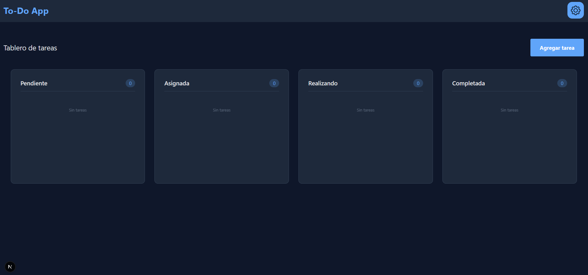
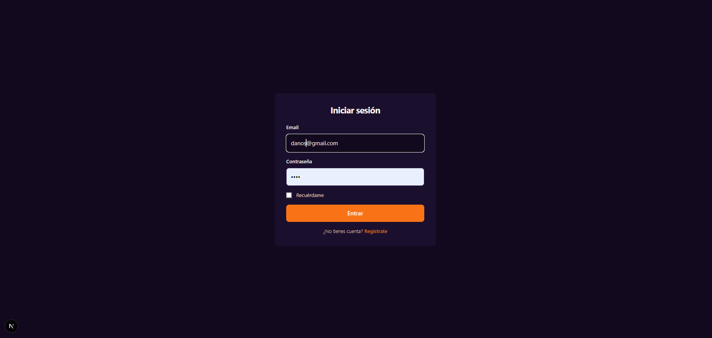
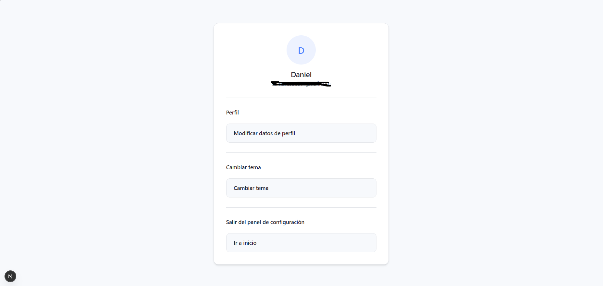

# ToDo App - Technical Documentation

## 1. Authentication System Data Flow

### 1.1 Flow Diagram

```
┌─────────────┐     ┌─────────────┐     ┌─────────────┐     ┌─────────────┐
│   Frontend  │────▶│   GraphQL   │────▶│   Resolver  │────▶│   Service   │
│   (Next.js) │     │     API     │     │  (NestJS)   │     │             │
└─────────────┘     └─────────────┘     └─────────────┘     └─────────────┘
       │                   │                   │                   │
       │ Mutation          │ Query/Mutation    │ Business          │
       │ Login/Register    │ validate          │ logic             │
       │                   │                   │                   │
       ▼                   ▼                   ▼                   ▼
┌─────────────┐     ┌─────────────┐     ┌─────────────┐     ┌─────────────┐
│    User     │     │   Schema    │     │ AuthService │     │   TypeORM   │
│  Interface  │     │   Types     │     │             │     │  Repository │
└─────────────┘     └─────────────┘     └─────────────┘     └─────────────┘
```

### 1.2 Registration Flow (Register)

```
1. User fills out form (email, password, fullName, gender)
         │
         ▼
2. Frontend: mutation register → GraphQL API
         │
         ▼
3. AuthResolver: receives CreateUserDto
         │
         ▼
4. AuthService.registerUser():
   a) Check if email already exists (searches with soft delete)
   b) If exists → throw BadRequestException
   c) If not → hashPassword(body.password)
   d) Save user to DB
    e) Generate JWT with payload { email }
         │
         ▼
5. AuthCookiesService.setTokenCookie() → sets "token" cookie
         │
         ▼
6. Returns { email } to frontend
```

### 1.3 Login Flow

```
1. User enters email and password
         │
         ▼
2. Frontend: mutation login → GraphQL API
         │
         ▼
3. AuthResolver: receives LoginDto
         │
         ▼
4. AuthService.loginUser():
   a) Find user by email (deletedAt: null)
   b) If not found → throw BadRequestException
   c) Verify password with verifyHashPassword()
   d) If no match → throw BadRequestException
    e) Generate JWT with payload { email }
         │
         ▼
5. AuthCookiesService.setTokenCookie() → sets "token" cookie
         │
         ▼
6. Returns { email, token } to frontend
```

### 1.4 Verification Flow

```
1. App loads → queries verification query
         │
         ▼
2. Frontend: query verification → GraphQL API
         │
         ▼
3. AuthResolver.verification():
   a) Extracts cookies from request
   b) AuthCookiesService.verifyTokenFromCookie()
   c) Decodes JWT
   d) Finds user in DB
   e) Generates new JWT (refresh)
   f) Updates cookie
         │
         ▼
7. Returns { email, message } to frontend
```

### 1.5 Route Protection

- **AuthGuard**: Validates that the JWT token is valid
- Task queries/mutations are only accessible with a valid token
- Token is sent via cookies (httponly, secure)

---

## 2. Data Model (UML)

### 2.1 Entity Diagram

```
┌─────────────────────────────────────────────────────────────┐
│                          User                               │
├─────────────────────────────────────────────────────────────┤
│ - id: string (PK)                                          │
│ - email: string (unique)                                   │
│ - password: string                                         │
│ - fullName: string                                         │
│ - gender: gender                                           │
│ - deletedAt: Date | null (soft delete)                     │
├─────────────────────────────────────────────────────────────┤
│ + tasks: Task[] (OneToMany)                                │
└─────────────────────────────────────────────────────────────┘
                              │
                              │ 1:N
                              ▼
┌─────────────────────────────────────────────────────────────┐
│                          Task                               │
├─────────────────────────────────────────────────────────────┤
│ - id: string (PK)                                          │
│ - title: string                                            │
│ - description: string                                      │
│ - priority: priorityState (baja|media|alta|urgente)        │
│ - deletedAt: Date | null (soft delete)                     │
├─────────────────────────────────────────────────────────────┤
│ - userId: string (FK) → User.id                            │
│ - user: User (ManyToOne)                                   │
└─────────────────────────────────────────────────────────────┘
```

### 2.2 Field Details

#### User
| Field | Type | Constraints |
|-------|------|---------------|
| id | UUID/INT | Primary Key, Auto-increment |
| email | VARCHAR(50) | Unique, Not Null |
| password | VARCHAR | Not Null (hashed bcrypt) |
| fullName | VARCHAR | Not Null |
| gender | ENUM | Not Null (masculino/femenino/otro) |
| deletedAt | DATETIME | Nullable (soft delete) |

#### Task
| Field | Type | Constraints |
|-------|------|---------------|
| id | UUID/INT | Primary Key, Auto-increment |
| title | VARCHAR | Not Null |
| description | TEXT | Not Null |
| priority | ENUM | Not Null (baja, media, alta, urgente) |
| deletedAt | DATETIME | Nullable (soft delete) |
| userId | INT | Foreign Key → User.id, Not Null |

### 2.3 Relationships

```
User  ──────────────  Task
   1                    N
   │                    │
   │                    │
   │◀───────────────────│
   │   (OneToMany)     │
   │   (ManyToOne)     │
   └────────────────────┘
   
   - A User can have many Tasks (1:N)
   - A Task belongs to a single User
   - ON DELETE CASCADE: deleting a User removes their Tasks
```

### 2.4 Database Tables

```sql
-- users table
CREATE TABLE users (
    id INT PRIMARY KEY AUTO_INCREMENT,
    email VARCHAR(50) UNIQUE NOT NULL,
    password VARCHAR NOT NULL,
    fullName VARCHAR NOT NULL,
    gender VARCHAR NOT NULL,
    deletedAt DATETIME NULL
);

-- tasks table
CREATE TABLE tasks (
    id INT PRIMARY KEY AUTO_INCREMENT,
    title VARCHAR NOT NULL,
    description TEXT NOT NULL,
    priority VARCHAR NOT NULL,
    userId INT NOT NULL,
    deletedAt DATETIME NULL,
    FOREIGN KEY (userId) REFERENCES users(id) ON DELETE CASCADE
);
```

---

## 3. GraphQL Endpoints

### 3.1 Authentication Module (AuthResolver)

| Operation | Type | Description |
|-----------|------|-------------|
| `register` | Mutation | Registers a new user and returns token |
| `login` | Mutation | Authenticates user and returns token |
| `verification` | Query | Verifies and renews the token |
| `me` | Query | Gets the currently authenticated user |
| `logout` | Mutation | Logs out and clears the cookie |

> **Note**: User creation is only available through the authentication module (`auth`). The `users` module only allows queries and updates.

### 3.2 Users Module (UsersResolver)

| Operation | Type | Description |
|-----------|------|-------------|
| `findAllUsers` | Query | Lists all users |
| `findOneUser` | Query | Gets a user by ID |
| `updateUser` | Mutation | Updates an existing user |
| `softDeleteUSer` | Mutation | Soft deletes a user |
| `cancelSoftDelete` | Mutation | Restores a soft-deleted user |
| `hardDeleteUser` | Mutation | Permanently deletes a user |

---

## Technologies Used

### Backend
- **NestJS** - Node.js framework
- **TypeORM** - ORM for database management
- **GraphQL** - API with Apollo Server
- **JWT** - Token-based authentication
- **Bcrypt** - Password hashing

### Frontend
- **Next.js** - React framework
- **Apollo Client** - GraphQL client
- **GraphQL Codegen** - Type generation

---

## Application Screenshots

### Login Screen


### Dashboard with Kanban


### Settings Section


---

## Notes

- The application implements **soft delete** on both entities
- Passwords are stored hashed with bcrypt
- JWT token is transmitted via HttpOnly cookies for security
- Tasks are associated with users and cascade-deleted